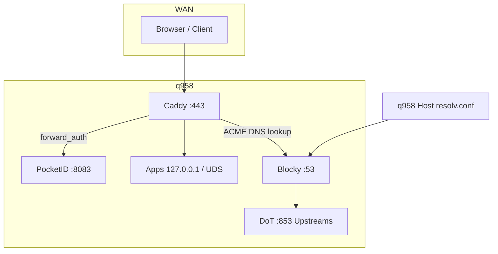

---
meta:
  role: doc
  purpose: Audit DNS, Blocky, Caddy, IPv6, RAM-Tiers q958
  docs:
    - docs/memory_oom.md
  tags:
    - audit
    - dns
    - ipv6
---

# Audit: Homelab-Infrastruktur (Blocky, Caddy, DNS, IPv6, Ressourcen) — q958

> **Host:** q958 · **RAM:** 32 GB · **Rollout:** Stufe 8 · **Letzte Aktualisierung:** 2026-06-17

---

## 1. Executive Summary

| Themenblock | Status | Kurzfassung |
|-------------|--------|-------------|
| **Blocky (DNS)** | ✅ Live | LAN :53 → DoT-WAN, DNSSEC, AAAA gefiltert, `Restart=always`, OOM -1000 |
| **Caddy (Ingress)** | ✅ Live | :80/:443, `Restart=always`, OOM -900, startet nach Blocky+PostgreSQL |
| **IPv6 Homelab** | ✅ v4-only | `eno1` aus, nftables/CrowdSec ohne v6, Tailscale ausgenommen |
| **Monitoring** | ✅ Gatus | `blocky-dns` + `caddy-ingress` in Gruppe `critical` |
| **DoT / fail-closed** | ✅ Live | Kein Klartext-Bypass, Build-Assertions |
| **Unix-Sockets** | ✅ Teilweise | Valkey, Postgres, Grafana, Forgejo — *arr bleibt TCP |
| **OOM/RAM-Isolation** | ✅ P1+P2 | `lib/memory-policy.nix` — siehe `docs/memory_oom.md`; P3 (nix-daemon) offen |

**Kritische Kette:** `LAN/Host → Blocky (DoT) → Internet` und `WAN → Caddy → Apps`

### Was dieses Dokument abdeckt

| Thema | Abschnitt |
|-------|-----------|
| Blocky, DoT, resolv.conf | §2 |
| Caddy, Start-Reihenfolge | §3 |
| IPv6 ad acta (v4-only LAN) | §5 |
| **Warum** die Änderungen so sind | §10 (Entscheidungslog) |
| **RAM/OOM** — Dienst darf OS nicht mitreißen | §11 + `docs/memory_oom.md` |
| Datei-Index, Checkliste, KI-Regeln | §6–§9 |

---

## 2. Blocky — DNS-Resolver

### 2.1 Rolle

- **Einziger** System- und LAN-DNS-Resolver (AdGuard deaktiviert — Port-53-Konflikt)
- **WAN-Egress:** ausschließlich **DNS-over-TLS** (Port 853)
- **LAN:** UDP/TCP Port 53 (Protokoll, kein TLS — normal für DNS im LAN)
- **Custom rewrites:** `*.nix.m7c5.de`, `nixhome.local` → LAN-IP (`192.168.2.73`)

### 2.2 Konfigurationsquellen (eine Wahrheit pro Schicht)

| Schicht | Datei | Inhalt |
|---------|-------|--------|
| Daten | `machines/q958/profile.nix` | `network.blocky.upstream`, `network.dns.bootstrap`, `network.lan.dns` |
| Verdrahtung | `machines/q958/network.nix` | `my.services.blocky.upstreamDns`, `my.configs.network.dnsBootstrap` |
| Modul | `modules/10-network.nix` | Blocky-Settings, systemd, Assertions |
| Policy | `lib/dns-policy.nix` | `isEncryptedUpstream`, Build-Assertions |
| Aktivierung | `machines/q958/rollout.nix` | `blocky.enable = erstAb 2` |

### 2.3 Aktuelle Upstreams (DoT only)

```nix
# machines/q958/profile.nix
upstream = [
  "tcp-tls:1.1.1.1:853"           # Cloudflare
  "tcp-tls:1.0.0.1:853"
  "tcp-tls:9.9.9.9:853"           # Quad9
  "tcp-tls:149.112.112.112:853"
  "tcp-tls:194.242.2.2:853"       # Mullvad
  "tcp-tls:dnsforge.de:853"
];
bootstrap = [ "tcp-tls:1.1.1.1:853" "tcp-tls:9.9.9.9:853" ];
```

### 2.4 Blocky-Settings (Modul)

| Setting | Wert | Warum |
|---------|------|-------|
| `connectIPVersion` | `v4` | Homelab ohne IPv6-WAN |
| `dnssec.validate` | `true` | Antworten kryptografisch prüfen |
| `filtering.queryTypes` | `[ "AAAA" ]` | Keine IPv6-Antworten nach außen |
| `ports.dns` | `53` | LAN-Resolver |
| `ports.http` | `4000` | Metriken (lokal) |

### 2.5 System-DNS (kein Bypass)

| Pfad | Wert |
|------|------|
| `networking.nameservers` | `[ "127.0.0.1" ]` |
| `/etc/resolv.conf` | NixOS-verwaltet, nur `127.0.0.1` |
| `networking.resolvconf` | **aus** (verhindert stale `1.1.1.1`) |
| `systemd-networkd eno1 DNS` | `[ "127.0.0.1" ]` (nur Host, nicht Fritzbox-Clients) |
| `systemd-resolved` | **aus** |

### 2.6 Assertions (Build bricht bei Regression)

In `modules/10-network.nix` (wenn Blocky aktiv):

- Upstreams müssen verschlüsselt sein (`tcp-tls:`, `https://`, …)
- Bootstrap verschlüsselt
- Keine Klartext-Upstreams
- `nameservers == [ "127.0.0.1" ]`
- `ipv6.firewall == false`

In `machines/q958/access.nix`:

- `lan.dns == [ "127.0.0.1" ]`
- `profile.nix` Upstreams/Bootstrap verschlüsselt

### 2.7 systemd — Crash-Resilienz

Datei: `lib/critical-systemd.nix` + `modules/10-network.nix`

| Parameter | Blocky-Wert |
|-----------|-------------|
| `Restart` | `always` |
| `RestartSec` | `5s` |
| `StartLimitIntervalSec` | `0` (unbegrenzte Restarts) |
| `StartLimitBurst` | `0` |
| `OOMScoreAdjust` | `-1000` (höchste Priorität) |
| `TimeoutStopSec` | `30s` |
| `before` | `caddy.service` (DNS vor Ingress) |
| `after` | `network-online.target` |

**Hinweis:** `Restart=always` garantiert Neustart nach Crash/OOM-Kill, nicht „nie Fehler“. Kombination mit Gatus `critical` für Alarmierung.

### 2.8 Monitoring

`machines/q958/gatus-endpoints.yaml`:

```yaml
- name: blocky-dns
  group: critical
  url: dns://cloudflare.com
  dns.resolver: 127.0.0.1:53
```

### 2.9 Abhängigkeiten

| Consumer | Braucht Blocky für |
|----------|-------------------|
| **Caddy** | ACME DNS-01 / Zertifikat-Renewal |
| **Host** | Paket-Downloads, API-Calls, Upstream-Lookups |
| **Gatus** | Health-Probe |
| **LAN-Clients** | Nur wenn Fritzbox DNS → `192.168.2.73` |

### 2.10 Risiken & Mitigation

| Risiko | Mitigation |
|--------|------------|
| Blocky down → kein DNS | `Restart=always`, Gatus critical, kein `1.1.1.1`-Fallback (fail-closed) |
| DoT-Upstream down | Mehrere Provider, Blocky `parallel_best` |
| Klartext-Regression im Git | `lib/dns-policy.nix` + Assertions |
| OOM-Kill | `OOMScoreAdjust=-1000`, `MemoryMax=500M` |

---

## 3. Caddy — Reverse Proxy / Ingress

### 3.1 Rolle

- **Einziger** öffentlicher HTTP/HTTPS-Endpunkt (:80, :443)
- TLS-Terminierung, ACME, SSO (`forward_auth` → PocketID)
- Proxy zu allen `*.nix.m7c5.de` vHosts (siehe Module 50-media, 60-apps, 70-forge, 40-observability)

### 3.2 Konfigurationsquellen

| Schicht | Datei |
|---------|-------|
| Aktivierung | `machines/q958/rollout.nix` → `services.caddy.enable = erstAb 5` |
| Hardening | `modules/60-apps/default.nix` |
| vHosts | verteilt in `modules/10-network.nix`, `40-observability.nix`, `50-media/`, `60-apps/`, `70-forge.nix` |
| Snippets | `lib/caddy-snippets.nix` (`sso_auth`, `tailscale_admin`, `security_headers`) |
| Proxy-Helper | `lib/caddy-helpers.nix` (TCP + Unix-Socket-Upstreams) |

### 3.3 Start-Reihenfolge (Deadlock-Vermeidung)

```
network-online.target
    → blocky.service
    → postgresql.service (PocketID / forward_auth)
    → caddy.service
```

Konfiguriert in `modules/60-apps/default.nix`:

- `after`: blocky, postgresql, network-online
- `wants`: blocky, network-online

### 3.4 systemd — Crash-Resilienz

| Parameter | Caddy-Wert |
|-----------|------------|
| `Restart` | `always` |
| `RestartSec` | `5s` |
| `StartLimitIntervalSec` | `0` |
| `OOMScoreAdjust` | `-900` |
| `TimeoutStopSec` | `30s` |
| `RestartPreventExitStatus` | `[]` (nixpkgs-Default `1` entfernt — sonst kein Restart bei Exit 1) |

### 3.5 Monitoring

`machines/q958/gatus-endpoints.yaml`:

```yaml
- name: caddy-ingress
  group: critical
  url: tcp://127.0.0.1:443
```

TCP-Connect reicht — kein HTTP nötig (kein SSO auf Probe).

### 3.6 Abhängigkeiten von Blocky

| Funktion | Ohne Blocky |
|----------|-------------|
| ACME Renew | ❌ schlägt fehl (DNS challenge) |
| Neue Zertifikate | ❌ |
| Bestehende HTTPS-Sessions | ✅ kurzzeitig (bis Cert abläuft) |
| `forward_auth` (PocketID) | ✅ (lokaler TCP, kein DNS) |

**Fazit:** Blocky ist **kritischer** als Caddy für Langzeit-Betrieb; beide sind für den Normalbetrieb essentiell.

### 3.7 CrowdSec / Fail2ban

- CrowdSec liest `caddy.service` Journal (`modules/40-observability.nix`)
- Fail2ban Jail `caddy-json` (Stufe 8)

---

## 4. Blocky ↔ Caddy — Zusammenspiel



---

## 5. IPv6-Policy — Homelab ad acta (v4-only)

### 5.1 Entscheidung

**IPv6 im Homelab-Bereich macht aktuell keinen Sinn** (Fritzbox-LAN v4, Geo-Blocklist nur v4, weniger nftables-Komplexität).  
**Ausnahme:** `tailscale0` — Mesh-VPN bleibt unberührt.

### 5.2 Konfigurationsquelle

```nix
# machines/q958/profile.nix
ipv6 = {
  disableOnInterfaces = [ "eno1" ];
  firewall = false;
};
```

Verdrahtung: `machines/q958/network.nix` → `my.configs.network.ipv6` + `my.security.firewall.ipv6`

### 5.3 Schichten (was IPv6 wo abschaltet)

| Schicht | Datei | Maßnahme |
|---------|-------|----------|
| **sysctl** | `modules/10-network.nix` | `disable_ipv6=1`, `accept_ra=0`, `autoconf=0` auf `eno1` |
| **systemd-networkd** | `machines/q958/access.nix` | `IPv6AcceptRA = no` auf LAN |
| **nftables** | `modules/15-firewall.nix` | Kein `crowdsec_blocked_ipv6`; Drop `iifname eno1 + nfproto ipv6` |
| **CrowdSec** | `modules/40-observability.nix` | `nftables.ipv6.enabled = false` |
| **Blocky** | `modules/10-network.nix` | `connectIPVersion=v4`, `filtering.queryTypes=[AAAA]` |
| **Blocky sandbox** | `modules/10-network.nix` | `RestrictAddressFamilies` ohne `AF_INET6` |
| **Assertion** | `modules/10-network.nix` | `ipv6.firewall == false` |

### 5.4 Was NICHT abgeschaltet ist

| Komponente | Warum |
|------------|-------|
| `tailscale0` | Mesh braucht ggf. v6 Link-Local / Tailscale-Protokoll |
| **LAN DNS Port 53** | DNS-Protokoll, nicht IP-Version — bleibt |
| **Privado WG** | `dns=[]`, kein resolv-Hijack |

### 5.5 Verifikation (Runtime)

```bash
# eno1 ohne IPv6
sysctl net.ipv6.conf.eno1.disable_ipv6   # → 1
ip -6 addr show dev eno1                 # → leer

# tailscale unberührt
sysctl net.ipv6.conf.tailscale0.disable_ipv6  # → 0

# nftables ohne crowdsec6
# → keine table ip6 crowdsec6

# Blocky keine AAAA-Antworten
dig @127.0.0.1 google.com AAAA           # → leer / NOERROR ohne AAAA
```

### 5.6 IPv6 später wieder aktivieren

1. `profile.nix`: `ipv6.firewall = true`, `disableOnInterfaces = [ ]`
2. Blocky: `filtering.queryTypes` entfernen, `connectIPVersion = dual`
3. Rebuild + testen

---

## 6. ADRs (Entscheidungslog kurz)

| ADR | Thema |
|-----|-------|
| [001](adr/001-dns-dot-fail-closed.md) | DoT, Blocky-only, fail-closed |
| [002](adr/002-ipv6-homelab-v4-only.md) | IPv6 ad acta, Tailscale-Ausnahme |
| [003](adr/003-oom-cgroup-isolation.md) | MemoryMax/OOM-Tiers |

Vollständiger Index: [`docs/adr/README.md`](adr/README.md)

---

## 7. Datei-Index (KI: hier anfangen)

```
machines/q958/
  profile.nix          # Blocky-Upstreams, IPv6-Policy, lan.dns
  network.nix          # Verdrahtung DNS + IPv6
  access.nix           # systemd-networkd LAN + DNS-Assertions
  rollout.nix          # blocky stufe 2, caddy stufe 5
  gatus-endpoints.yaml # critical: blocky-dns, caddy-ingress

modules/
  10-network.nix       # Blocky, DoT, resolv.conf, IPv6 sysctl, Assertions
  15-firewall.nix      # nftables v4-only + eno1 v6 drop
  40-observability.nix # CrowdSec ohne v6, Gatus, Grafana-UDS
  60-apps/default.nix  # Caddy hardening + Start-Reihenfolge

lib/
  dns-policy.nix       # Verschlüsselungs-Assertions
  memory-policy.nix    # MemoryMax/OOM-Tiers (P1) — Details: docs/memory_oom.md
  critical-systemd.nix # Restart=always, OOM, StartLimit=0
  caddy-helpers.nix    # reverse_proxy Bausteine
  caddy-snippets.nix   # SSO, tailscale_admin
  unix-sockets.nix     # UDS-Pfade (Grafana, Forgejo, Valkey)
```

---

## 7. Verifikations-Checkliste (nach jedem Rebuild)

```bash
# Dienste aktiv + Restart-Policy
systemctl show blocky caddy -p ActiveState,Restart,OOMScoreAdjust,StartLimitIntervalSec

# DNS DoT + lokal
grep -E 'tcp-tls|bootstrap' /nix/store/*-config.yaml 2>/dev/null | head -5
cat /etc/resolv.conf                                    # nur 127.0.0.1
dig @127.0.0.1 cloudflare.com +dnssec +short            # mit RRSIG

# IPv6
sysctl net.ipv6.conf.eno1.disable_ipv6
dig @127.0.0.1 google.com AAAA +short                   # leer

# Gatus critical
curl -s http://127.0.0.1:8084/api/v1/endpoints/status | jq '.[] | select(.group=="critical")'
```

---

## 8. Regeln für KI-Änderungen

### NIEMALS (ohne explizite User-Freigabe)

- Klartext-DNS-Upstreams (`1.1.1.1`, `8.8.8.8`) in `profile.nix`
- `1.1.1.1` in `lan.dns` oder `networking.nameservers`
- `ipv6.firewall = true` im Homelab-v4-Setup
- `Restart=on-failure` oder Start-Limits auf Blocky/Caddy
- AdGuard Home aktivieren (Port-53-Konflikt)

### IMMER prüfen nach DNS/Ingress-Änderungen

1. `nixos-rebuild build` — Assertions müssen grün sein
2. `systemctl status blocky caddy`
3. Gatus critical-Gruppe
4. Dieses Dokument aktualisieren wenn Architektur sich ändert

---

## 10. Entscheidungslog — wie und warum

Kurz: **Was** steht in §2–§5; hier **warum** — damit Regressionen bewusst und nicht aus Versehen passieren.

### 10.1 DNS-over-TLS (DoT) statt Klartext

| Entscheidung | Begründung |
|--------------|------------|
| Upstreams nur `tcp-tls:…:853` | DNS-Anfragen zum WAN-Provider verschlüsselt; kein Klartext auf dem Weg zum Resolver |
| Mehrere Provider (CF, Quad9, Mullvad, dnsforge) | `parallel_best` — Ausfall eines Anbieters blockiert nicht alles |
| Bootstrap ebenfalls DoT | Auch die Auflösung der Resolver-Hostnames läuft verschlüsselt |
| `lib/dns-policy.nix` + Assertions | Regression (jemand trägt `1.1.1.1` ein) bricht den Build — nicht erst im Betrieb |

### 10.2 `127.0.0.1` only — kein `1.1.1.1`-Fallback

| Pfad | Wert | Warum |
|------|------|-------|
| `networking.nameservers` | `[ "127.0.0.1" ]` | Host nutzt **immer** Blocky |
| `/etc/resolv.conf` | NixOS-verwaltet, nur Blocky | Kein Bypass wenn Blocky kurz down ist |
| `resolvconf` | **aus** | Verhindert stale Einträge (`1.1.1.1` von früheren Setups) |
| `lan.dns` (systemd-networkd) | `[ "127.0.0.1" ]` | Nur **Host**-Interface — nicht Fritzbox-DHCP für LAN-Clients |

**Fail-closed:** Wenn Blocky ausfällt, gibt es keinen heimlichen Klartext-DNS — Gatus `critical` + `Restart=always` sollen das beheben, nicht ein Fallback der Policy untergräbt.

### 10.3 IPv6 Homelab „ad acta“

| Maßnahme | Warum |
|----------|-------|
| `disable_ipv6=1` auf `eno1` | Fritzbox-LAN ist v4; v6 auf PHY bringt Komplexität ohne Nutzen |
| nftables/CrowdSec ohne v6-Sets | Geo-Blocklist und CrowdSec-Logik sind v4-fokussiert |
| Blocky `connectIPVersion=v4` + AAAA-Filter | Keine v6-Upstream-Pfade, keine AAAA-Antworten ins LAN |
| **Tailscale ausgenommen** | Mesh-VPN braucht eigenes v6-Protokoll — nicht mit LAN-PHY verwechseln |

### 10.4 Unix-Sockets (wo sinnvoll)

| Dienst | Transport | Warum |
|--------|-----------|-------|
| Valkey | nur UDS | Cache lokal, kein TCP-Port im Netz |
| PostgreSQL | `listen_addresses=""` | DB nur per Socket — PocketID, Forgejo, Paperless |
| Grafana, Forgejo | `http+unix` + Caddy `proxyUnix*` | Weniger TCP-Listener, Caddy als einziger Ingress |
| *arr, Jellyfin, SABnzbd | TCP `127.0.0.1` | Upstream-NixOS-Module erwarten TCP; VPN-Kill-Switch an UID gebunden |

### 10.5 `lib/critical-systemd.nix`

| Parameter | Warum |
|-----------|-------|
| `Restart=always` | Crash/OOM des **Dienstes** → automatisch wieder hoch |
| `StartLimitIntervalSec=0` | nixpkgs limitiert sonst nach N Crashes — für DNS/Ingress unakzeptabel |
| `OOMScoreAdjust` negativ | Globaler Kernel-OOM-Killer tötet **zuerst** andere Prozesse |
| Caddy `RestartPreventExitStatus=[]` | nixpkgs-Default Exit 1 = kein Restart — ACME-Fehler würden Ingress dauerhaft down lassen |

**Wichtig:** `Restart=always` schützt vor **Dienst-Ausfall**, nicht vor **RAM-Überlauf ohne cgroup-Limit** — dafür §11.

---

## 11. RAM & OOM — Dienst darf das OS nicht mitreißen

### 11.1 Problem

Wenn ein Dienst (Jellyfin-Transcode, SABnzbd-Par2, Loki, Paperless-OCR) RAM frisst, darf nicht der **gesamte** Kernel-OOM-Killer wild drauflos gehen (SSH, Blocky, systemd). Ziel: **Isolation pro Dienst**.

### 11.2 Zwei Mechanismen (komplementär)

| Mechanismus | Wirkung | Wo konfiguriert |
|-------------|---------|-----------------|
| **`MemoryMax` / `MemoryHigh`** (systemd cgroup) | Überschreitung → **nur dieser** Dienst wird gekillt/neu gestartet | `systemd.services.*.serviceConfig` |
| **`OOMScoreAdjust`** (global) | Bei **systemweitem** RAM-Notstand: niedriger Score = später getötet | gleiche `serviceConfig` |
| **App-Limits** | z. B. Valkey `maxmemory`, Postgres `shared_buffers` | Service-Settings |

**Regel:** Für „RAM-Fresser“ braucht es **beides**: `MemoryMax` (harte Käfigwand) + positiver `OOMScoreAdjust` (zweite Verteidigung). Für Infrastruktur: negativer Score, moderates `MemoryMax` wo sinnvoll.

### 11.3 System-Baseline (q958, 32 GB)

| Komponente | Status | Anmerkung |
|------------|--------|-----------|
| ZRAM | ✅ Stufe 1 | ~25 % RAM ≈ 8 GB komprimierter Swap, `vm.swappiness=180` |
| Postgres `shared_buffers` | ✅ | ~8 GB (25 % RAM) — **ohne** cgroup `MemoryMax` ⚠️ |
| Valkey `maxmemory` | ✅ | 256 MB in App — cgroup fehlt ⚠️ |
| nix-daemon | ⚠️ | `maxJobs=4`, kein `MemoryMax` — Rebuilds können spiken |
| systemd-oomd | ❌ | Nicht aktiv — optional später |

### 11.4 Ist-Stand aller Rollout-Dienste (Stufe 8)

Legende: **Score** = `OOMScoreAdjust` · **Cap** = `MemoryMax`/`MemoryHigh`

#### Tier 0 — Betriebssystem-Lebensader (nie zuerst killen)

| Dienst | Score | Cap | Bewertung |
|--------|-------|-----|-----------|
| `blocky` | -1000 | High 200M / Max 500M | ✅ Vorbild |
| `sshd` | -1000 | — | Score ok, Cap optional 128M |
| `tailscaled` | -1000 | — | Score ok, Cap optional 256M |
| `systemd-networkd` | default | — | ⚠️ nicht explizit |

#### Tier 1 — Ingress & Identität (hoch, aber begrenzbar)

| Dienst | Score | Cap | Bewertung |
|--------|-------|-----|-----------|
| `caddy` | -900 | — | ⚠️ **Cap fehlt** — Vorschlag 512M–1G |
| `pocket-id` | -900 | — | ⚠️ Vorschlag Max 256M |
| `postgresql` | default | — | ⚠️ **kritisch** — Vorschlag Max ~10G, Score -800 |
| `gatus` | default | — | ⚠️ Monitoring sollte klein bleiben — Max 128M, Score -500 |

#### Tier 2 — IoT-Bus (mittel)

| Dienst | Score | Cap | Bewertung |
|--------|-------|-----|-----------|
| `mosquitto` | -100 | — | ok für Bus; Max 128M sinnvoll |
| `zigbee2mqtt` | default | — | ⚠️ Max 512M, Score +100 |

#### Tier 3 — Observability (wachsen mit Logs)

| Dienst | Score | Cap | Bewertung |
|--------|-------|-----|-----------|
| `loki` | default | — | ⚠️ **Priorität 1** — Max 1G, Score +300 |
| `vector` | default | — | ⚠️ Max 512M, Score +200 |
| `grafana` | default | — | ⚠️ Max 512M, Score +200 |
| `crowdsec` + bouncer | default | — | Max 512M gesamt |

#### Tier 4 — Media & Downloads (expendable, RAM-Spitzen)

| Dienst | Score | Cap | Bewertung |
|--------|-------|-----|-----------|
| `jellyfin` | **+100** | — | Score ok, **Cap fehlt** — Vorschlag 4–6G (Transcode) |
| `sonarr` / `radarr` / `readarr` / `prowlarr` | default | — | ⚠️ je Max 512M, Score +200 |
| `sabnzbd` | default | — | ⚠️ **Priorität 1** — Max 2G (Par2/unrar), Score +300 |
| `seerr` | default | — | Max 512M, Score +200 |

#### Tier 5 — Apps (expendable)

| Dienst | Score | Cap | Bewertung |
|--------|-------|-----|-----------|
| `home-assistant` | +300 | Max 2G | ✅ Vorbild |
| `open-webui` | +200 | — | ⚠️ Max 2G (LLM-UI) |
| `linkwarden` / `filebrowser` | +300 | — | ⚠️ Max 512M |
| `paperless` (+ worker) | default | — | ⚠️ **Priorität 1** — Max 2G gesamt, Score +250 |
| `n8n` | default | — | Max 1G, Score +250 |
| `vaultwarden` | default | — | Max 512M, Score +200 |
| `forgejo` | default | — | Max 1G, Score +200 |
| `amp` | default | — | ⚠️ Game-Server — pro Instanz prüfen, Max 4G+ |
| `redis-valkey` | default | App 256M | cgroup Max 384M empfohlen |

### 11.5 Empfohlene RAM-Budgets (32 GB — Richtwerte)

```
Infrastruktur (Tier 0–1):     ~2–3 GB   (Blocky, Caddy, SSH, Tailscale, Gatus)
PostgreSQL:                   ~8–10 GB  (shared_buffers + Work-Mem-Spitzen)
Valkey + Mosquitto:           ~0,5 GB
Observability:                ~2 GB     (Loki 1G + Vector + Grafana)
Media exp. (capped):          ~10–12 GB (Jellyfin 6G + *arr 2G + SAB 2G + Puffer)
Apps exp. (capped):           ~6–8 GB   (HA 2G + Paperless 2G + Rest)
OS + Page-Cache + ZRAM:       Rest
```

Summe der **Caps** sollte > 32 GB sein dürfen (nicht alle Spitzen gleichzeitig) — aber **einzelne** Dienste dürfen nie unbegrenzt wachsen.

### 11.6 Implementierungs-Backlog (priorisiert)

| Prio | Maßnahme | Datei(en) |
|------|----------|-----------|
| ~~**P1**~~ | ~~`MemoryMax` Jellyfin, SABnzbd, Loki, PostgreSQL, Paperless~~ | ✅ `lib/memory-policy.nix` — siehe `docs/memory_oom.md` |
| ~~**P2**~~ | ~~*arr, Caddy, Pocket-ID, Vector, Grafana~~ | ✅ `docs/memory_oom.md` §4b |
| **P3** | `lib/memory-policy.nix` — `mkExpendable` / `mkCritical` Helfer | `lib/` + Module |
| **P3** | nix-daemon `MemoryMax` bei Builds (z. B. 16G) oder `daemonLowPriority` testen | `00-core.nix`, `profile.nix` |
| **P4** | systemd-oomd + `ManagedOOM` für user.slice | optional, nach Caps |

### 11.7 Verifikation nach Umsetzung

```bash
# cgroup-Limits live
systemctl show jellyfin loki postgresql sabnzbd -p MemoryMax,MemoryCurrent,OOMScoreAdjust

# Wer wurde wann gekillt?
journalctl -k -g "oom\|Out of memory" --since "7 days ago"
journalctl -u jellyfin -g "killed\|oom" --since "7 days ago"
```

---

## 9. Changelog

| Datum | Änderung |
|-------|----------|
| 2026-06-17 | `docs/adr/` — ADR 001–003 (DNS, IPv6, OOM) |
| 2026-06-17 | P2 RAM-Limits (*arr, Caddy, Pocket-ID, Vector, Grafana) |
| 2026-06-17 | P1 RAM-Limits via `lib/memory-policy.nix` + `docs/memory_oom.md` |
| 2026-06-17 | §10 Entscheidungslog (DoT, fail-closed, IPv6, UDS, critical-systemd) |
| 2026-06-17 | §11 RAM/OOM-Tier-Analyse + Implementierungs-Backlog |
| 2026-06-17 | DoT-only Upstreams + DNS-Assertions |
| 2026-06-17 | resolv.conf nur 127.0.0.1, resolvconf aus |
| 2026-06-17 | IPv6 eno1 off, CrowdSec/nftables ohne v6 |
| 2026-06-17 | `lib/critical-systemd.nix` für Blocky/Caddy |
| 2026-06-17 | Gatus `caddy-ingress` critical |
| 2026-06-17 | Blocky AAAA-Filter, `connectIPVersion=v4` |
| 2026-06-17 | Caddy StartLimit-Override (nixpkgs 14400s entfernt) |
| 2026-06-17 | Initiales Audit-Dokument |