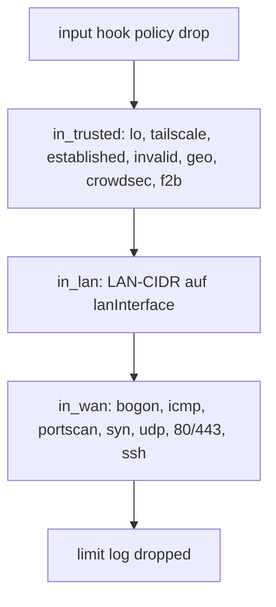

---
meta:
  role: doc
  purpose: Guide — nftables L4-Härtung für Homelab q958
  docs:
    - docs/adr/008-nftables-l4-hardening.md
  tags:
    - guide
    - nftables
---

# Guide: nftables L4-Härtung

> **Rollout:** Stufe 8+ · **Modul:** `modules/15-firewall.nix` · **Generator:** `lib/nftables-rules.nix`

## Rollen-Trennung

| Schicht | Aufgabe | Modul |
|---------|---------|-------|
| L4 Filter | Geo, Rate, SYN/UDP, skuid, Fail2ban | `15-firewall.nix` |
| DNS Adblock | StevenBlack, Easyprivacy | Blocky (`10-network.nix`) |
| L7 Auth | SSO, Streaming | Caddy |

**Kein Geo in Caddy** — eine Wahrheit in nftables.

## Chain-Ablauf



## Optionen (`my.security.firewall`)

| Option | Default q958 | Beschreibung |
|--------|--------------|--------------|
| `checkRuleset` | `true` | Syntax-Check vor Aktivierung |
| `lanInterface` | `eno1` | LAN nur von physischem Interface |
| `wanInterface` | `""` | Single-NIC — kein WAN-Iface |
| `tailscaleNotrack` | `true` | raw NOTRACK für `tailscale0` |
| `skuidSegmentation.enable` | Stufe 8 | UID-basierte Micro-Segmentation |

## Fail2ban ↔ nftables

Bei aktivem Firewall-Modul:

- Set: `inet filter f2b_blocked_ipv4` (timeout 1h)
- Banaction: `nftables-f2b-set` (in `20-security.nix`)
- Regel: `ip saddr @f2b_blocked_ipv4 drop` in `in_trusted` (vor HTTP)

## skuid (UID-Registry)

| UID | Dienst | Regel |
|-----|--------|-------|
| 969 | Prowlarr | output: nur VPN/LAN/Tailscale |
| 984 | SABnzbd | output: nur VPN/LAN/Tailscale |
| 989/978/987 | Sonarr/Radarr/Readarr | input: kein WAN, nur LAN+Tailscale |

Registry: `lib/uid-registry.nix`.

## Verifikation nach Rebuild

```bash
sudo nft list ruleset | less
sudo nft list set inet filter f2b_blocked_ipv4
systemctl status nftables fail2ban
```

## Alerting (optional)

`modules/05-alerting.nix` — ntfy/Matrix-Webhook bei VPN-NetNS- oder Restic-Fehler.  
URLs in `profile.local.nix` unter `alerting.ntfyTopic` / `alerting.webhookUrl`.